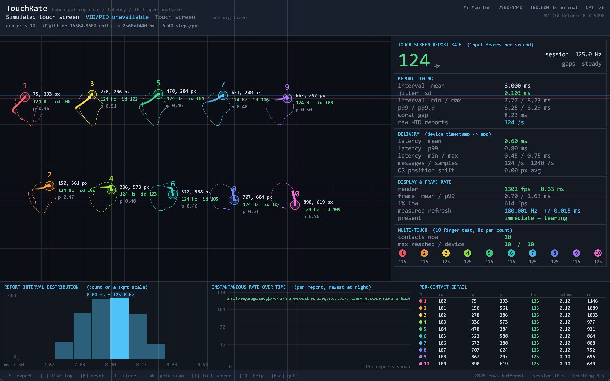

# TouchRate

## Background

I was looking for a portable touch monitor suitable for playing rhythm games on
a Windows PC, and found there is very little public data on the polling rate of
these monitors — apart from [the page on iidx.org](https://iidx.org/touch_monitor).
So I measured them myself, and built a tool to do it consistently.

## Tested monitor results

**[→ Skip to measurements for every panel I tested personally so far](results/README.md)**

## Touch screen, touch pad and pen analyzer

TouchRate is a native Windows tool for evaluating touch input for rhythm games
and other latency-sensitive use. It measures three kinds of input: a touch
screen, a laptop's precision touch pad and a pen. For each one it gives the
report rate, timing jitter and worst gap. Each input is measured on its own, so
a laptop that has all three never mixes their figures.

- **Touch screen** — the rate at every contact count from one finger to ten, a
  10-finger tracking test, delivery latency, touches the panel reported that
  Windows never delivered, and a grid scan for dead zones.
- **Touch pad** — read from its own HID reports, because Windows never passes a
  touch pad to applications as touch. It is timed on the pad's own clock, and
  also gets the rate at each contact count.
- **Pen** — pressure, shown live and exported, along with tilt and the barrel
  and eraser buttons, the rate with the tip down and while hovering, and
  delivery latency.

It also identifies each digitizer by VID/PID, measures the monitor's real
refresh rate and its own frame rate, and exports everything for offline
analysis.

Direct3D 11 with a flip-model swap chain, immediate present and tearing allowed,
so what you see on the panel is as close to the input as the display path
permits.



*Ten fingers on a simulated 125 Hz touch screen.*

## Build

Requires Visual Studio (2019 or newer) with **Desktop development with C++**,
or a standalone Windows SDK + MSVC build tools.

```bat
build.bat
```

Output is `build\TouchRate.exe` — a single self-contained executable, statically
linked against the CRT, with no runtime dependencies beyond Windows itself.

```bat
build.bat debug
build.bat clean
```

## Run

```bat
build\TouchRate.exe
```

| Option | Meaning |
| --- | --- |
| `--list` | Print detected digitizers with VID/PID and exit |
| `--vsync` | Start with vsync on (default is immediate present) |
| `--fullscreen` | Start borderless full screen |
| `--no-history` | Do not recover coalesced pointer frames |
| `--capacity=N` | Sample rows buffered for export (default 500000) |
| `--export-dir=PATH` | Where `[S]` writes files (default `<exe dir>\exports`) |
| `--log` | Start streaming samples to CSV immediately |

The window opens on the display the touch screen is mapped to — or, with no
touch screen, a pen display — rather than the primary one, and fills that
display when it is too small for the full layout (1080p at 125% scaling, for
example). A touch screen plugged in while TouchRate runs, when none was
connected before, brings the window over to its display.

### Keys

| Key | Action |
| --- | --- |
| `S` | Export everything measured so far |
| `L` | Start/stop streaming every sample to CSV |
| `O` | Open the export folder |
| `R` | Reset all measurements |
| `C` | Clear the drawn ink and trails |
| `V` | Toggle vsync |
| `H` | Toggle coalesced-frame recovery |
| `T` `G` `I` `P` | Toggle trails / grid / ink / sample dots |
| `D` | Re-enumerate touch devices |
| `F` | Borderless full screen — required to test the screen edges |
| `Tab` | Grid scan: switch to the dead zone test screen and back |
| `+` `-` | Grid scan: finer / coarser cells (`C` clears the grid) |
| `F1` | Help |
| `Esc` | Quit, or leave the grid scan |

## What it measures

### Touch report rate

Counts distinct **input frames** using the hardware timestamp
(`POINTER_INFO::PerformanceCount`) carried on each pointer report. One frame is
one scan of the digitizer, regardless of how many fingers it contains — so the
rate does not inflate when you add fingers.

Windows coalesces pointer reports when an app cannot keep up. TouchRate replays
the per-frame history (`GetPointerFrameTouchInfoHistory`) to recover every
report the hardware actually sent. Press `H` to turn that off and see the
delivery rate an app would observe if it read only the newest sample per
message — the difference between the two is how much a slow app would lose.

The rate is the average gap between reports, turned into reports per second.
Only the normal gaps count: a gap far longer than the rest, left by a report the
digitizer missed, is not averaged in, so a missed report shows up in the worst
gap and the tail rather than dragging the rate down. The screen, the exported
report and the [results table](results/README.md) all give this one rate, and
it is the figure to compare panels by.

Reported alongside it:

- **mean rate** — 1 / the mean of every gap, missed reports included, so it
  drops if the device stalls
- **jitter (sd)** — the number that matters most for rhythm games; a steady
  100 Hz beats an erratic 200 Hz
- **worst gap** — the longest interval between consecutive reports; a single
  long gap is a dropped note
- **p99 / p99.9** — the tail, where the misses live

Intervals are only measured while the screen is continuously touched. The pause
between two separate touches is the user's, not the digitizer's, and is never
counted as a gap.

### When the gap between reports varies

Most panels keep the same gap between reports every time. Some keep switching
between a shorter and a longer one, often because they can only send on a
whole millisecond. Say a panel's gaps run 8 ms, 8 ms, 9 ms, over and over: its
most common gap is 8 ms, which would make it a 125 Hz panel, but it averages
one report every 8.33 ms — 120 a second. Going by the most common gap alone
overstates such a panel; the average gives the 120 it actually sends.

Each export's **How the rate is measured** section says whether the panel's
gap varies, quoting the panel's own figures, and sets the rate beside the one
the most common gap alone would give at every contact count. The gap counts as
varying when the two differ by more than 2% at any contact count with at least
100 intervals. On screen, the report rate block reads `gaps steady` or
`gaps vary`.

Versions of TouchRate before this one reported the most common gap as the
rate, so an export made with one of them shows that figure instead.

### Report rate by contact count

Many panels slow down as fingers are added, which is exactly the case a rhythm
game hits during dense passages. TouchRate attributes every measured interval
to the number of contacts the digitizer was tracking while that interval
elapsed, and reports the rate for each count separately.

The multi-touch panel shows the rate under each finger-count pip live, amber
once a count runs below 80% of the best rate observed. The report carries the
full table — rate and mean Hz, mean interval, jitter, worst gap and interval
count per contact count — plus each count as a percentage of the single-contact
baseline, and `raw/rate_by_contacts.csv` has the same data for plotting.

A real example — the [EVICIV 18.5"](results/eviciv-18-5-120hz-1080p/README.md)
panel, whose full export is in this repo:

| contacts | 1 | 2 | 3 | 4 | 5 | 6 | 7 | 8 | 9 | 10 |
| --- | --- | --- | --- | --- | --- | --- | --- | --- | --- | --- |
| Hz | 86 | 69 | 59 | 52 | 49 | 47 | 46 | 45 | 42 | 40 |
| % of 1 finger | 100 | 80 | 69 | 60 | 57 | 54 | 54 | 52 | 49 | 47 |

Press one finger, then two, and so on up to ten, holding each for a few seconds
so every row gets enough intervals — the `Intervals` column tells you which rows
are well supported.

### Panels that split a scan across reports

A panel that tracks more contacts than its HID report has slots sends the rest
in continuation reports — HID hybrid mode — so ten fingers can arrive as two
five-contact reports. TouchRate reassembles them into the scan they belong to,
and counts scans rather than reports, so its rate stays comparable with a panel
that fits every contact into one report. The export says so when it happens,
with the report count, the scan count and how many reports were continuations,
and the panel's contact capacity is taken as the larger of what the device
declares and the slots in its report.

### Touch delivery

TouchRate reads the digitizer's own HID reports through Raw Input and decodes
them — contact IDs, positions and the TipSwitch flag — independently of the
Windows pointer stack. It then matches every contact the panel reported against
the pointer contacts Windows actually delivered, by position and time.

Only touches that start in TouchRate's own window are judged. Windows delivers
a touch to the window under the finger, so with TouchRate windowed, a touch on
another application, the desktop, the taskbar or TouchRate's title bar rightly
goes there instead. TouchRate hit-tests where each panel contact starts and
counts those separately, as touches on other windows, not as lost. In full
screen the window covers the whole display, so touches at the screen edge are
still judged.

A touch the panel reported but Windows never delivered is marked on screen with
a red cross, flagged live with a pulsing ring while the finger is still down,
and counted as lost in the stats panel. The export lists each one with its
position, duration and distance from the screen edge, and diagnoses the cause:

- **Lost at the screen edges, outside full screen** — Windows reserves the edges
  for swipe gestures and hands those touches to the shell instead of the window
  under the finger.
- **Lost with edge-swipe blocking in effect** — the touch started on TouchRate's
  own window and still never arrived, so neither edge gestures nor another
  window explain it: look for a system setting or background tool that reserves
  the edge.
- **On another window while full screen** — something sits above TouchRate,
  most often the taskbar or an always-on-top overlay. Those touches went to that
  window, so they are counted with the other-window touches, not as lost.
- **Lost in groups of three or more fingers** — Windows 11 takes a three- or
  four-finger touch as a system gesture (switching apps, Task View, showing the
  desktop) and passes none of it to the window. Turn off **Settings > Bluetooth
  & devices > Touch > Three- and four-finger touch gestures** to measure
  multi-finger touches.
- **Reports arrive but no contact is ever flagged as touching** — the panel
  detected something and chose not to report it as a touch: firmware edge or
  palm rejection.
- **Held back while a pen is in range** — Windows sets touch aside while a pen
  is near the screen, so that a hand resting on it while you write does not
  draw. A panel contact Windows did not deliver, from shortly before the pen was
  last in range, is counted as held back rather than lost, and gets no red
  cross.

**Test the screen edges in full screen (`F`).** TouchRate blocks Windows edge
swipes for its window, but Windows only honours that while the window is full
screen; windowed, the edges will read as dead even on a perfect panel. Each
export records whether blocking was in effect.

### Delivery latency

Time from the hardware timestamp on a report to the moment this process
dequeued it. This covers **driver and OS input handling only**. It excludes
panel scan-out and display processing, so it is a floor for end-to-end latency,
not a measurement of it — true photon latency needs external instrumentation
(a high-speed camera or a photodiode rig).

Note also that a device whose driver stamps reports at OS ingestion rather than
at hardware sampling will report an optimistically low figure here. Compare
against the raw HID count and the interval distribution before trusting it.

### Grid scan (dead zone test)

`Tab` switches to a separate screen: a full-screen grid with only a translucent
status bar along the bottom. Drag slowly over the whole screen, edges and
corners included. Every cell a touch lands in turns green, brightening a little
with use. An untouched cell next to a touched one is tinted red — a hole the
finger swept around, or a dead strip along an edge — so once the screen is
painted, whatever is still red is a dead zone.

Only reported sample positions mark a cell. A swipe is deliberately not filled
in between its samples, since that would paint straight over a dead zone the
finger crossed. The flip side is that a fast swipe on a slow panel leaves gaps
of its own; going back over a red cell slowly tells a real dead zone from a
missed spot.

Entering the grid scan goes full screen on the monitor the touch screen is
mapped to, since Windows takes edge touches outside full screen and a grid on
any other monitor could never be touched. `+` and `-` change the cell size
without losing the scan. Cells are counted across the long side of the screen
(40 by default, roughly fingertip-sized on a 15-16" panel), so the same setting
gives the same physical cells at any resolution. Touches the panel reported but
Windows did not deliver still appear as red crosses, so a cell can be told
apart as dead in the panel or taken by Windows.

When a scan has been run, the export adds a section with coverage, untouched
cells per edge, and a character map of the screen, plus
`raw/grid_coverage.csv`.

### 10-finger test

Tracks up to 20 concurrent contacts with stable slot assignment and colour.
The pips in the multi-touch panel light up as you reach each simultaneous
contact count, so pressing all ten fingers fills the row. The panel compares
what you reached against what the device itself declares — its own maximum,
or the contact slots in its HID reports, whichever is larger — rather than
the system-wide `SM_MAXIMUMTOUCHES`. The two device figures differ on panels
in hybrid mode, which split ten fingers across two five-slot reports.

A watchdog releases any contact that stops reporting for 2 s without an up
message. If that ever triggers, the report says so — it means the input stream
lost a release, which in a game shows up as a stuck note.

### OS position processing

The distance between the processed position Windows reports
(`ptPixelLocation`) and the unprocessed one (`ptPixelLocationRaw`). A non-zero
mean means the OS is smoothing or predicting your input. TouchRate draws and
records the raw position.

### Touch pad

A laptop's precision touch pad is measured as well, entirely apart from the
touch screen. Windows never passes a touch pad to an application as touch input
— it turns it into cursor movement and gestures — so TouchRate reads the pad's
own HID reports through Raw Input and decodes them itself: contacts, positions,
the click button, and the Confidence flag the pad uses to reject a palm.

- **Separate figures.** The pad gets its own report rate, jitter, worst gap,
  rate by contact count, contact table and export section, so a laptop with
  both inputs never mixes the two. Pad reports never enter the touch screen's
  delivery check either.
- **The view follows your fingers.** The analyzer shows whichever input a
  finger last went down on, and the stats title says which. A laptop with a
  touch pad and no touch screen starts on the pad.
- **Drawn to scale.** The pad's surface is drawn in the open canvas at its real
  size ratio, from the physical size in its descriptor, with each contact where
  it is on the pad and a dot for every report along its trail.
- **Timed on the pad's own clock.** Precision touch pads stamp every report
  with a scan time in 100 µs units, so intervals come from the pad itself
  rather than from when Windows passed the report on. TouchRate checks that
  clock against the host's over the first two seconds of touching and falls
  back to arrival times if the two disagree. The difference between them is
  reported as the jitter added between the pad and the app.
- **Clocks that count in whole milliseconds.** Many pads only advance that
  field in 1 ms steps, so a steady 7.44 ms period reads as a mix of 7 and 8 ms
  gaps. The rate is an average of those gaps, so it comes out right; the most
  common gap says nothing on such a pad, and jitter and worst gap carry up to
  one step of rounding. TouchRate detects the step, and the report and the
  screen both say so.
- **Bunched delivery.** Reports that reach the app together with the next one,
  although the pad produced them a full interval apart, are counted, with the
  longest wait between arrivals. Anything reading the pad gets those two
  reports at once.
- **Palms and split frames.** Contacts the pad flags as unintended are counted
  but not measured. Pads that split a frame with many fingers across several
  reports (hybrid mode) are reassembled into whole frames first.

### Pen

A pen — the one that comes with a 2-in-1, or a pen display or drawing tablet —
is measured on its own too, from the pointer input Windows delivers for it
(`GetPointerPenInfoHistory`, with the same coalesced-frame recovery as touch).
None of its figures are mixed into the touch screen's.

- **Rate with the tip down.** A pen reports while it hovers as well as while it
  touches. Its report rate, jitter, worst gap and latency count only the reports
  with the tip down, as for a finger, and the view switches to the pen when its
  tip goes down. The rate while hovering is measured apart, so a pen that
  reports more slowly in the air shows it.
- **Pressure, live.** At the pen tip, a bright ring grows with the pressure
  inside a pale one that marks full pressure, and the stroke is drawn as wide as
  it was pressed. The stats column gives the pressure now on a gauge, the
  pressure each stroke started at, and the peak; the strip below plots the
  pressure of every report, broken at each lift.
- **As Windows passes it on.** Pressure is 0 to 1024, shown as 0 to 1, whatever
  the pen resolves itself. The header gives the levels the pen declares in its
  HID descriptor, and the export how many of Windows' 1025 values the session
  actually produced.
- **Tilt and buttons.** Tilt where the pen reports it, and the barrel button
  and eraser, lit while held.
- **Palm rejection.** While the pen is in range, Windows holds touch back so
  that a resting hand does not draw; see [Touch delivery](#touch-delivery).

### Display and frame rate

- **nominal refresh** — exact rational signal timing from the display config
  (e.g. 119.998 Hz, not a rounded 120)
- **measured refresh** — real vblank intervals timed on a dedicated thread,
  which is the panel's actual rate including any variance
- **render fps / frame time / 1% low** — the app's own frame pacing, so you can
  confirm the tool itself is not the bottleneck

The DWM composition figure is desktop-wide and will differ from the measured
vblank on a multi-monitor setup with mixed refresh rates.

### Spatial resolution

Digitizer logical extents versus the mapped display area, expressed as device
steps per display pixel. Higher means finer positional quantisation.

## Export

`[S]` writes one folder per run, with the readable summary at the top and the
bulk measurements grouped underneath:

```
exports/touchrate_20260912_125034/
├── README.md      rendered summary - GitHub shows it on opening the folder
├── summary.json   the same figures, machine-readable
└── raw/
    ├── samples.csv.gz
    ├── rate_by_contacts.csv
    ├── contacts.csv
    ├── interval_histogram.csv
    ├── latency_histogram.csv
    ├── frametime_histogram.csv
    ├── undelivered_touches.csv
    ├── grid_coverage.csv                  only when a grid scan was run
    ├── touchpad_samples.csv.gz            touchpad_* only when a touch pad was used
    ├── touchpad_rate_by_contacts.csv
    ├── touchpad_contacts.csv
    ├── touchpad_interval_histogram.csv
    ├── pen_samples.csv.gz                 pen_* only when a pen was used
    ├── pen_interval_histogram.csv
    └── pen_latency_histogram.csv
```

The summary is Markdown and named `README.md` so that GitHub, GitLab and
similar render it automatically when you open the run folder — a committed
measurement is readable in the browser with no tooling.

| File | Contents |
| --- | --- |
| `README.md` | Headline figures, rate by contact count, how the rate is measured, timing, latency, multi-touch, hardware identification and observations |
| `summary.json` | Every figure above, machine-readable |
| `raw/samples.csv.gz` | Every buffered sample: device and host timestamps, interval, instantaneous Hz, latency, client/screen/raw/himetric coordinates, prediction delta, pressure, contact area. gzip — around 6x smaller, and read directly by `pandas.read_csv`, R, 7-Zip and `zcat` |
| `raw/rate_by_contacts.csv` | Report rate (`rate_hz`) for each simultaneous contact count, beside the rate from the most common gap alone (`modal_hz`) and the mean over every gap, with percent of the single-contact baseline |
| `raw/undelivered_touches.csv` | Every touch that started in TouchRate's window and that Windows did not deliver: position, duration, distance from the edge, whether edge-swipe blocking was in effect |
| `raw/grid_coverage.csv` | Grid scan only: every cell's position relative to the monitor and how many samples landed in it |
| `raw/contacts.csv` | Per-contact summary: sample count, interval stats, path length, down latency |
| `raw/interval_histogram.csv` | Report-interval distribution with Hz equivalents |
| `raw/latency_histogram.csv` | Delivery-latency distribution |
| `raw/frametime_histogram.csv` | Render frame-time distribution |
| `raw/touchpad_*` | Touch pad only: every sample in pad units, timed on both the pad's clock and the host's; rate by contact count; per-contact summary; interval distribution |
| `raw/pen_*` | Pen only: every sample with the tip down, with pressure (0 to 1, and the 0–1024 value Windows passes on), tilt, rotation and button flags; interval and latency distributions |

`[L]` streams samples continuously to `exports/live/` instead, for sessions
longer than the in-memory ring holds. A touch pad streams to its own
`_touchpad_live.csv` beside it, and a pen to `_pen_live.csv`.

In `raw/samples.csv.gz`, all contacts belonging to one hardware report share a
`frame_id` and `device_qpc` — group by those to reconstruct frames. The
`from_history` column marks samples recovered from coalesced frames; their
`latency_ms` is not meaningful (they were already queued), so filter on
`from_history=0` for latency analysis.

## Notes and limitations

- Latency figures cover the input stack only, never the display path.
- The persistent ink layer is cleared when the window is resized.
- Immediate present renders uncapped by design, which keeps input-to-present
  latency minimal but keeps the GPU busy. Press `V` for vsync if you would
  rather not.
- The process runs at high priority so that the tool's own scheduling does not
  add jitter to what it is measuring.
- Raw Input is received on a dedicated high-priority thread that stamps each
  report as it arrives, so arrival times do not wait on the render loop. It is
  registered with `RIDEV_INPUTSINK`, so HID report counts and touch pad
  measurements include input made while another window has focus.
- Windows edge swipes are blocked for the window, which Windows only honours in
  full screen. Outside full screen, touches that start at the screen edge where
  TouchRate's window reaches it go to the shell and are reported as lost.
- HID positions map from the digitizer's logical range onto its display. A
  rotated display is not yet accounted for, so lost-touch positions may be
  misplaced on one.
- Touch feedback visuals are disabled for the window; the shell draws those on
  top and adds latency of its own.

## Credits

Inspired by [iidx.org/touch_monitor](https://iidx.org/touch_monitor), which was
the only public collection of touch-monitor polling-rate data I could find when
I started looking, and the reason I went and measured these panels myself.

## AI disclosure

The TouchRate tool's source code was written by Claude (Anthropic's Claude
Code), working from my requirements and iterating against real hardware.

The measurements are not AI-generated. Every result in
[results/](results/README.md) comes from running the tool on a physical panel,
and the comment column in that table is my own assessment from actually using
each monitor.

## License

Public domain, via [the Unlicense](LICENSE). Copy it, modify it, ship it, sell
it, fork it — no attribution required and no conditions attached. TouchRate has
no third-party dependencies, so nothing else's terms apply to the binary you
build either.
